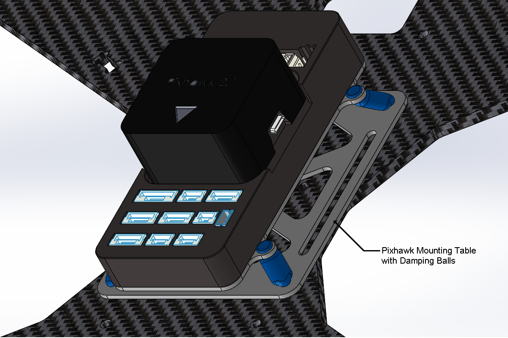

Basic Setup
=====================
This section gives information about setting up an autopilot system for basic use. It covers connection and wiring of most submodules and peripherals required for such.

Mount and Orient Autopilot
--------------------------

The autopilot should be positioned as close to the vehicle’s center of gravity as possible. Ideally, the autopilot should be mounted in the standard orientation, indicated by the heading mark arrow pointing out the front/nose of the vehicle. 

.. note::
   To mount the autopilot in a non-standard orientation, reconfigure the autopilot parameter AHRS_ORIENTATION to recognize the new orientation. This adjusts sensors readings to realign with the vehicle.

Vibration Damping
-----------------

The autopilot should be mounted on vibration absorbing material, which isolates the sensitive sensors from vibrations. Soft foam such as 3M Damping Foam, gel pads, and mounting tables with rubber damping balls are effective in vibration isolation. 

.. note::
	Some autopilots incorporates vibration damping for sensors. This is typically insufficient since the vibration damping in autopilots tend to be tuned to a specific class of vehicle.

