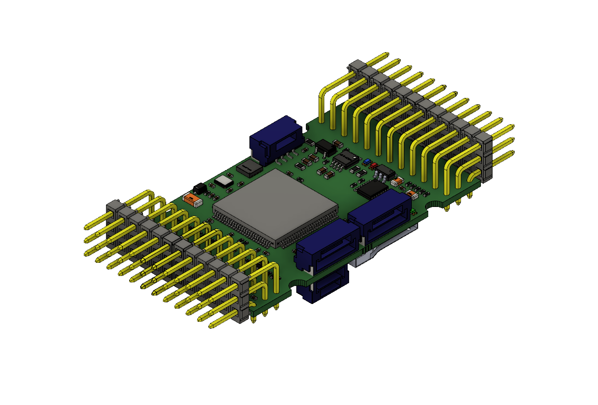

Autopilot Hardware
------------------
Pixhawk series autopilots all run PX4 or ArduPilot firmware, but the hardware differ in interfaces and form factor. This section summarizes the available autopilot hardware and groups them into three categories.

General purpose
~~~~~~~~~~~~~~~
These are full-feature autopilots with a full set of interfaces, i.e. 8+6 Main and Aux outputs, 5 serial ports, analog ports. They are suitable for a wide range of airframes and configurations. They can further be categorized by their intended applications.

-	Industrial / Commercial

These are well tested and widely available at a reasonable price. They are optimized for easy deployment on industrial or professional UAVs. 

	-	Pixhawk
	-	Pixhawk 2.1
	-	mRobotics X2.1

-	Academic / Research

These are computationally powerful and feature-rich, and accordingly more expensive. They are good platforms for developing bleeding-edge capabilities

	-	Pixhawk 3 Pro
	-	Pixhawk 4
	-	CUAV v5

Miniaturized
~~~~~~~~~~~~
These are small and lightweight autopilots with reduced interfaces. They are suitable for space-constrained configurations, e.g. FPV racers. A recent update adapted Ardupilot to run on flight controllers designed for FPV racing/freestyle, so there are two distinct families of mini autopilots.

-	Pixhawk Family

These are miniaturized autopilots based on the Pixhawk architecture. They are mostly compatible with the original Pixhawk and are easy to setup.

	-	Pixhawk Mini
	-	Pixracer
	-	Pixhawk 4 Mini

-	Racing/Freestyle Family

These are flight controllers originally designed for FPV racing/freestyle quadcopters. They are very lightweight and possess innovative features like integrated OSD (flight data overlay on video feed)

	-	Omnibus F4/F7
	-	Kakute F4/F7
	-	Mateksys F405
	-	OpenPilot Revo
	-	Taulabs Sparky2

.. note:: Racing/Freestyle flight controllers are harder to setup as they don't have connector ports, instead having copper tabs that users can directly solder signal wires to

Derivative
~~~~~~~~~~
These are derivatives of one of the above designs. They are less well tested, but retain the set of features and capabilities of their parent design

	-	Dropix
	-	Pixhack
	-	MindPX

.. warning:: Exotic designs are excluded from this list. It is the end-user’s responsibility to find them and verify their capabilities.

Linux Based
~~~~~~~~~~~
These extend the popular Raspberry Pi microcomputer with a set of sensors and interfaces, transforming it into an autopilot. They are computationally powerful but require extensive Linux experience to setup successfully

	-	NAVIO2
	-	PXFMini
	-	Erle Brain
