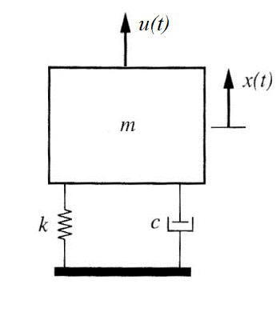
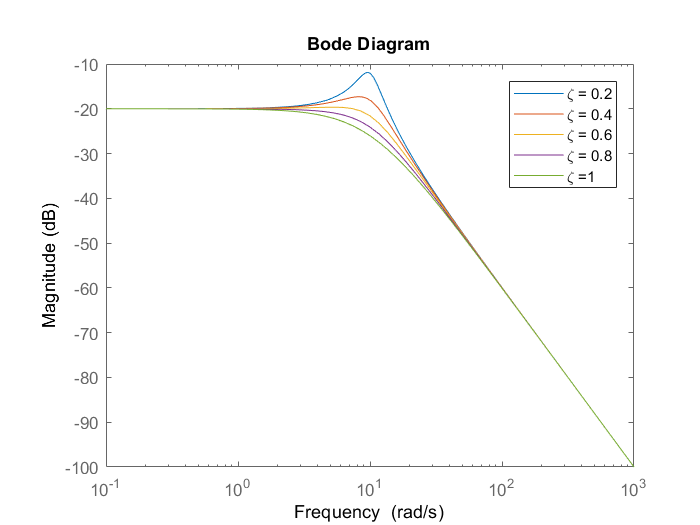

Advanced Topics
===============

Vibration Damping
-----------------
The ideal vibration absorbing material is viscoelastic, which dissipates the energy in vibrations and does not behave like a spring. Ideal vibration damping attenuates high frequency motion. 

Model for Soft Mounting
~~~~~~~~~~~~~~~~~~~~~~~
A soft-mounted autopilot can be modelled as a mass on a vibration isolator. Let :math:`x(t)` be the displacement of the autopilot and :math:`u(t)` be some force acting on the autopilot. This could be the transmitted vibration which typically manifests as AccelZ values exceeding 15m/s/s in Ardupilot logs.

The equation of motion is shown below

.. math::

	m \ddot{x}(t) + c \dot{x}(t) + k x(t) = u(t)

The foregoing equation can be rewritten, by using damping ratio :math:`\zeta = \frac{c}{2\sqrt{mk}}` and natural frequency :math:`\omega_0 = \sqrt{\frac{k}{m}}`

.. math::

	\ddot{x}(t) + 2\zeta \omega_0 \dot{x}(t) + \omega_0^2 = \frac{u(t)}{m}

Using Laplace transforms, the transfer function from the force acting on the autopilot to the displacement of the autopilot can be obtained

.. math::

	G(s) = \frac{m}{s^2 + 2\zeta \omega_0 s + \omega_0^2}

This transfer function reflects several common considerations in soft-mounting autopilots. Firstly, recall that the damping ratio varies from underdamped (:math:`\zeta <1`), critically damped (:math:`\zeta = 1`), to overdamped (:math:`\zeta > 1`). The mass will no longer oscillate if the system is critically damped or overdamped. 

Hence, vibration isolaters are tuned so that the damping ratio :math:`\zeta` approaches 1. The expression :math:`\zeta = \frac{c}{2\sqrt{mk}}` also shows that viscoelastic materials with high damping coefficient :math:`c` contributes to good vibration absorption by driving :math:`\zeta` beyond 1, while excessively elastic materials with high elastic modulus :math:`k` drives :math:`\zeta` below 1, rendering the system underdamped and introducing oscillations.

Frequency response
~~~~~~~~~~~~~~~~~~

Next, a Bode plot of the foregoing transfer function can be drawn to provide information on the frequency response of the system when for different damping ratios. 

The Bode plot demonstrates the vibration isolator's effect of attenuating high frequency motion. In the case of critical damping (light green line), then the vibration isolator progressively attenuates motion past a cutoff frequency, which is exactly the natural frequency :math:`\omega_0`. This echoes the idea that vibration isolation acts like an electronic low pass filter. 

On the other hand, if the system is underdamped, then the system exhibits resonance and amplifies oscillations. This is visible from the resonant peaks approaching the natural frequency. Due to material limitations, practical vibration isolators for autopilots can never achieve critical damping. 

Rather, vibration isolators compromise between tuning the cutoff frequency and limiting resonance. Referring back to the expression for the natural frequency

.. math::
	
	\omega_0 = \sqrt{\frac{k}{m}}

This shows that a low natural frequency is achieved with a low elastic modulus :math:`k` and high autopilot mass :math:`m`. This lends credence to the known practice of attaching lead weights to the autopilot to reduce the cutoff frequency. Nevertheless, the magnitude of the resonance peak increases with system mass, so weighing down the autopilot has hazards.

Sources of vibration
~~~~~~~~~~~~~~~~~~~~

The most important source of vibration is the motors. All motors vibrate, with frequency and amplitude being a characteristic of the motor speed and rotating mass. Mounting the motors on vibration absorbing material is the best way to reduce the impact of vibrations on the vehicle. Unfortunately, vibration damping for motors tend to conflict with the need to securely mount the motors. 

Another consequence of motor vibration is that slow motors driving large propellers induce low frequency, high amplitude vibrations that are hard to mitigate using viscoelastic vibration isolators. For this reason, heavy quadcopters using very large propellers (exceeding than 30-inch) are uncommon.

Other sources of vibration that can be mitigated by good vehicle design and maintenance include:

-	Damaged or unbalanced motor or propellers acts like a rotating unbalance, contributing to very severe vibration
-	Flexible structural components like airframe plates and arms cause asynchronous vibration
-	Unsecure fasteners and components inside the airframe cause vibration
