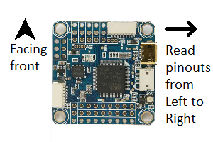
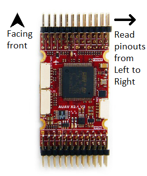
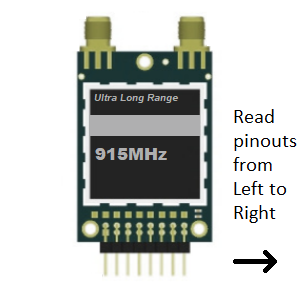
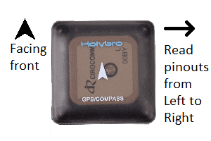

# Autopilots
## Omnibus F4V5
The Omnibus F4V5 is a common AIO autopilot with very small footprint. It can run either Ardupilot (Copter 3.6 or higher), or Betaflight for better racing performance.

### Rear headers
Omnibus F4 V5 (version 5) uses pin headers to interface with peripherals and external modules

The following table labels each pin from left to right when the Omnibus F4's heading arrow points forward from the reader's point of view

| Name | Description | Name | Description | Name | Description |
|------|---------------|-------|----------------|-----------|-----------------|
| GND | Ground | 5VP | 5V Power | LED Strip | Addressable LED |
| Buz- | Buzzer -ve | Buz+ | Buzzer +ve | GND | Ground |
| GND | Ground | VBat | Battery Power | 5VP | 5V Power |
| GND | Ground | Curr | Current Sensor | SCL | I2C SCL |
| GND | Ground | RSSI | RSSI Input | SDA | I2C SDA |
| GND | Ground | GND | Ground | GND | Ground |
| 5VP | 5V Power | 5VP | 5V Power | 3V/5V | 3.3/5V Power |
| RAM | Video Power | Tx1 | Serial1 Tx | Tx | Serial3 Tx |
| VBat | Battery Power | Power | Serial1 Rx | Rx | Serial3 Rx |

### Side headers
The side headers contain pins for the flight controller's internal OSD.

| Name | Description | Name | Description |
|------|---------------|------|-------------|
| Vin | Camera pin | Vout | VTx pin |
| RAM | Video Power | RAM | Video Power |
| AGND | Analog Ground | AGND | Analog |

### Motor output JST-SH Socket
A JST-SH socket is provided for easy connection to 4-in-1 ESCs

| Name | Description |
|------|---------------|
| VBat | Battery Power |
| Rx1 | Serial1 Rx |
| GND | Ground |
| NC | Not Connected |
| PWM1 | PWM output |
| PWM2 | PWM output |
| PWM3 | PWM output |
| PWM4 | PWM output |

### Power output pins
Use a jumper to connect __RAM__ on the rear headers to either __VBat__ or __5VP__. This feeds respectively battery power or 5V power to the RAM pin to power cameras or video transmitters.

Bridge the 3V/5V solder jumper very close to the 3V/5V pin to the 5V side. This is necessary because most GPS units use 5V input. 

## mRobotics X2.1
The mRobotics X2.1 is reduced version of PixHawk 1 with better sensors and more flexibility. This goal is achieved by using pin headers to interface with peripherals and external modules

### Front headers
The front headers contain pins for the following ports: Telem2, Serial4, Serial5, ADC1/2, Airspeed sensor, RC input, SBUS output, Spektrum input.

The following table labels each pin from left to right when the X2.1 autopilot's heading arrow points forward from the reader's point of view

| Name | Description | Name | Description | Name | Description |
|------|------------------|--------|---------------|---------|---------------|
| U1Rx | Spektrum input | GND | Ground | VCC Spk | 3.3V Power |
| SORI | Sbus out/RSSI in | NC | Not connected | GND | Ground |
| SIPI | Sbus in/PPM in | Vcc Rx | Power Supply | GND | Ground |
| AIR | Airspeed input | 5VP | 5V Power | GND | Ground |
| KILL | Unimplemented | 5VP | 5V Power | Buzz | Buzzer Driver |
| SAFE | Safety Switch | LED | LED Driver | IO3V3 | 3.3V power |
| GND | Ground | GND | Ground | GND | Ground |
| ADC2 | ADC input | P2.2 | Ready to Send | ADC2 | ADC input |
| GND | Ground | CTS | Clear to Send | GND | Ground |
| Rx | Serial4 Rx | Rx | Serial2 Rx | Rx | Serial5 Rx |
| Tx | Serial4 Tx | Tx | Serial2 Tx | Tx | Serial5 Tx |
| 5VP | 5V Power | 5VP | 5V Power | 5VP | 5V Power |

# Radios and Transceivers

## RFD900X

The RFD900X is a long range radio modem capable of PPM passthrough. 

| Pin # | Name | Description | Pin # | Name | Description |
|-------|------|---------------|-------|------|--------------|
| 1 | GND | Ground | 2 | GND | Ground |
| 3 | CTS | Clear to Send | 4 | Vcc | Power Supply |
| 5 | Vusb | USB Power | 6 | Vusb | USB Power |
| 7 | Rx | UART Rx | 8 | P2.3 | GPIO |
| 9 | Tx | UART Tx | 10 | P2.2 | GPIO |
| 11 | RTS | Ready to Send | 12 | P2.1 | GPIO |
| 13 | P0.1 | GPIO | 14 | P2.0 | GPIO |
| 15 | P1.1 | GPIO with PPM | 16 | GND | Ground |

### Power input pins
To power the modem from an external +5V supply, connect +5V power input to __pin 4 Vcc__, and ground to __pin 2__

To power the modem via a USB-FTDI cable, use a jumper to connect __pin 4__ and __pin 6__. This feeds +5V on __Vusb__ into __Vcc__

### Bootloader pads
The __SWO__ pad is above pin 16. To force the modem into bootloader mode, join it to ground by bridging it with __pin 16 GND__ or the __RESET__ pad next to it

# Companion Computers
## Raspberry Pi
The Raspberry Pi is a common single-board computer. It can be used in an UAS application as a companion computer to carry out computer vision tasks, or act as a WiFi bridge

| Pin # | Name | Description | Pin # | Name | Description |
|-------|--------|---------------|-------|--------|---------------|
| 1 | 3V3 | 3V3 Power | 2 | 5V | 5V Power |
| 3 | SDA | I2C SDA | 4 | 5V | 5V Power |
| 5 | SCL | I2C SCL | 6 | GND | Ground |
| 7 | GPIO4 | GPIO | 8 | Tx | Serial Tx |
| 9 | GND | Ground | 10 | Rx | Serial Rx |
| 11 | GPIO17 | GPIO | 12 | PWM0 | PWM output |
| 13 | GPIO27 | GPIO | 14 | GND | Ground |
| 15 | GPIO22 | GPIO | 16 | GPIO23 | GPIO |
| 17 | 3V3 | 3V3 Power | 18 | GPIO24 | GPIO |
| 19 | MOSI | SPI MOSI | 20 | GND | Ground |
| 21 | MISO | SPI MISO | 22 | GPIO25 | GPIO |
| 23 | CLK | SPI CLK | 24 | CE0 | Chip Select 0 |
| 25 | GND | Ground | 26 | CE1 | Chip Select 1 |
| 27 | ID_SD | I2C ID EEPROM | 28 | ID_DC | I2C ID EEPROM |
| 29 | GPIO5 | GPIO | 30 | GND | Ground |
| 31 | GPIO6 | GPIO | 32 | GPIO12 | GPIO |
| 33 | GPIO13 | GPIO | 34 | GND | Ground |
| 35 | GPIO19 | GPIO | 36 | GPIO16 | GPIO |
| 37 | GPIO26 | GPIO | 38 | GPIO20 | GPIO |
| 39 | GND | Ground | 40 | GPIO21 | GPIO |

### Serial connection
Autopilots and telemetry radios interface with the Raspberry Pi via the serial port. Connect the external device __Rx__ to __Pin 8 Tx__, and its __Tx__ to __Pin 10 Rx__

# Others

## HolyBro M8N GPS
The [HolyBro M8N GPS](https://www.getfpv.com/holybro-micro-m8n-gps-module.html) is fairly common due to its M8N chipset, good performance, and good plastic enclosure. However, its pinout is unconventional

| Name | Description |
|------|--------------|
| SCL | I2C SCL |
| SDA | I2C SDA |
| Vcc | Power Supply |
| Rx | Serial Rx |
| Tx | Serial Tx |
| GND | Ground |
