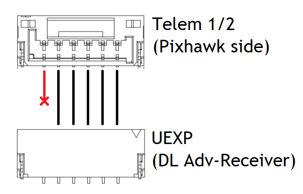

DragonLink
==========

DragonLink is a 915MHz UHF RC system. Compared to other UHF systems, its primary advantage is its full support for bidirectional telemetry, including MAVLink telemetry for ArduPilot. 

Configuration for the DragonLink system is primarily done in a very user-friendly GUI configuration. Download the DragonLink GUI configurator and manual in the following page. There is no need to install from an .exe or .msi installer. 

`V3 Complete System`_

.. Note::
   Navigation in the GUI will not be explained in detail. All configuration instructions below will be labelled by the associated page/tab in the GUI configurator

Basic Setup
-----------
Connect DragonLink Transmitter to radio
~~~~~~~~~~~~~~~~~~~~~~~~~~~~~~~~~~~~~~~

DragonLink works with any radio that supports RC signal output to external transmitters. The very popular FrSky Taranis radio connects to external transmitters via pins in the JR module-bay behind the radio. Connect the radio pins to the DragonLink Transmitter as follows. 

.. tip::
   Use the locking latch on the DragonLink Transmitter connector to identify polarity! 

.. figure:: ./Graphics/pin_conn.png
   :scale: 50%
   :alt: Taranis to DragonLink

   Read as if holding radio upright

*For advanced users: When using TBS's CRSF protocol, modify the connection to the radio such that the radio signal follows the Green wire in the diagram*

Connect Transmitter to the GUI configurator and change settings as described below, and always save settings after each change

**General Settings**: Set *input 1* to the signal protocol used by the RC transmitter on its trainer jack or module-bay pins. The following protocols are supported:

- u-PPM
- S.Bus
- CRSF (Sent on the "*telemetry*" pin on Taranis transmitters)
- u-PPM 14SG
- PPM

Binding
~~~~~~~

Binding identifies one specific receiver to a transmitter. Procedure:

1. Connect DragonLink Transmitter to the GUI configurator.
2. **General Settings**: Place the DragonLink Transmitter in Bind mode
3. Power on the Dragonlink Receiver
4. Successful binding is indicated by flashing Blue and Green LEDs on the receiver
5. Power cycle both transmitter and receiver after successful binding

.. note::
   It possible to place the DragonLink Transmitter in Bind Mode without connecting to the GUI. See `Extra Options via Menu Button`_ section.

Setting transmitter ID
~~~~~~~~~~~~~~~~~~~~~~

Each DragonLink Transmitter must be set an unique ID such that multiple DragonLink transmitters may be used in promixity. Setting ID is done in the GUI configurator.

**General Settings**: Set *ID* to a unique, non-default value, then rebind the receiver to the transmitter

Configuring Receiver Interfaces
~~~~~~~~~~~~~~~~~~~~~~~~~~~~~~~

The signal output pins of the DragonLink Receiver can be configured to serve different purposes. Procedure:

1. Connect Receiver to the GUI configurator and change settings as described below, and always save settings after each change
2. **Rx Outputs**: Pick a channel and select a function from the dropdown menu

+------------------+------------------------------------------------------------------------------------+
| Option           | Definition                                                                         |
+------------------+------------------------------------------------------------------------------------+
| PWM1-12          | PWM signal pin for one corresponding channel                                       |
+------------------+------------------------------------------------------------------------------------+
| RSSI             | RSSI signal pin, encoding signal strength as a PWM signal value                    |
+------------------+------------------------------------------------------------------------------------+
| SBus             | SBus RC protocol signal pin                                                        |
+------------------+------------------------------------------------------------------------------------+
| Spectrum         | Spectrum RC protocol signal pin                                                    |
+------------------+------------------------------------------------------------------------------------+
| PPM              | PPM signal pin carrying all channels in one stream                                 |
+------------------+------------------------------------------------------------------------------------+
| GPS RX           | Serial Receive pin for GPS module                                                  |
+------------------+------------------------------------------------------------------------------------+
| Serial in/out    | Serial pins for passing raw serial data and MAVLink telemetry data from autopilots |
+------------------+------------------------------------------------------------------------------------+
| DragonLink OSD   | Serial pins for passing data to the DragonLink OSD                                 |
+------------------+------------------------------------------------------------------------------------+
| Vector Open Telm | Signal pin for passing telemetry data from Eagletree Vector autopilots             |
+------------------+------------------------------------------------------------------------------------+

Setting Transmit Power
~~~~~~~~~~~~~~~~~~~~~~

Received Signal Strength Indication (RSSI)
~~~~~~~~~~~~~~~~~~~~~~~~~~~~~~~~~~~~~~~~~~
RSSI indicates the remaining link budget available to the vehicle. DragonLink receivers may send an analog RSSI signal (0-3.3V) or a digital RSSI signal (embedded into the PPM/SBus stream). This section only describes configuration for Digital RSSI

.. Tip::
   Digital RSSI is recommended because not all autopilots have analog ports to read analog RSSI.

1. Connect Receiver to the GUI configurator and change settings as described below, and always save settings after each change
2. **Receiver Outputs**: Configure channel mixing in the PPM / SBUS stream under *PPM/S-Bus out*. Select any channel other than channel 1-5 to output Digital RSSI. 
3. **Set ArduPilot Parameters**: Set Parameters as follows

+----------------+--------+------------------------------+
| Parameter      | Value  | Description                  |
+----------------+--------+------------------------------+
| RSSI_TYPE      | 2      | RC Channel PWM Value         |
+----------------+--------+------------------------------+
| RSSI_CHANNEL   | Any >5 | Receiver RSSI channel number |
+----------------+--------+------------------------------+
| RSSI_CHAN_LOW  | 1500   | RSSI PWM low value           |
+----------------+--------+------------------------------+
| RSSI_CHAN_HIGH | 1900   | RSSI PWM high value          |
+----------------+--------+------------------------------+

4. **Display RSSI on Mission Planner**: Right-Click on the HUD, click **User Items**, and check the **rxrssi** item in the window that opens up. Alternately, Double-Click on any flight data field on the **Quick** tab under the HUD, and check the **rxrssi** item in the window that opens up.

Telemetry Setup
---------------
To enable MAVLink telemetry communication, both DragonLink Hardware and Software must be setup

Connect DragonLink receiver to Autopilot
~~~~~~~~~~~~~~~~~~~~~~~~~~~~~~~~~~~~~~~~

Connect the DragonLink receiver's UEXP port to the Pixhawk Telem1 or Telem2 port as shown in diagrams below. 

.. image:: ./Graphics/5pos_GH.png
   :scale: 50%
   :alt: For other Receivers

When using the Advanced Receiver with Flow Control, stock Pixhawk telemetry cables can be used. Otherwise, a custom cable must be created with the Flow Control wires removed. In all cases, remove the power wire to prevent power supplies fighting each other.

Receiver Configuration
~~~~~~~~~~~~~~~~~~~~~~

Connect Receiver to the GUI configurator and change settings as described below, and always save settings after each change

**Radio Modem**: Set *Input/output buad rate* to 38400 (57600 when using Flow Control) and click *Save Baud*

.. Note::
   Turn on Mavlink Decoding to enable flight data display on RC transmitter screen. Otherwise keep disabled

**Receiver Outputs**: Set the outputs for the 5-pin UEXP port as follows

+----------------+-------------+
| Setting        | Description |
+----------------+-------------+
| UEXP con pin 3 | Serial In   |
+----------------+-------------+
| UEXP con pin 4 | Serial Out  |
+----------------+-------------+

When using Flow Control, set the outputs for the 6-pin UEXP port as follows

+----------------+-------------+
| Setting        | Description |
+----------------+-------------+
| UEXP con pin 2 | Serial In   |
+----------------+-------------+
| UEXP con pin 3 | Serial Out  |
+----------------+-------------+
| UEXP con pin 4 | CTS         |
+----------------+-------------+
| UEXP con pin 5 | RTS         |
+----------------+-------------+

Transmitter Configuration
~~~~~~~~~~~~~~~~~~~~~~~~~

Adjust settings in the GUI configurator as described below, and always save settings after each change
**RF Settings**: Select 9X mode

**External Connections**
- Set baudrate to 57600
- Select **Radio Modem** for Bluetooth or USB depending on preferred connection method to Mission Planner.

.. Warning::
   Once the USB function is set to Radio Modem, the transmitter will not connect to the GUI configurator until the GUI config USB function is re-enabled again by selecting one of the `Extra Options via Menu Button`_

- Save settings and re-bind transmitter to receiver

Set ArduPilot Parameters
~~~~~~~~~~~~~~~~~~~~~~~~
**Serial Port**: SERIAL1, SR1 and SER1 specifies that the Telem1 hardware port is being configured. If Telem2 is used, change SERIAL2 and so on. 

+------------------+-------+-----------------------+
| Parameter        | Value | Description           |
+------------------+-------+-----------------------+
| SERIAL1_PROTOCOL | 1/2   | Mavlink 1 or 2        |
+------------------+-------+-----------------------+
| SERIAL1_BAUD     | 38    | 38400 Bauds           |
+------------------+-------+-----------------------+
| BRD_SER1_RTSCTS  | 0     | Disable Flow Control  |
+------------------+-------+-----------------------+

.. Note::
   Set **SERIAL1_BAUD** to 57 and **BRD_SER1_RTSCTS** to 1 when using Flow Control

**Data streaming Rate**

+------------------+-------+
| Parameter        | Value |
+------------------+-------+
| SR1_EXT_STAT     | 1     |
+------------------+-------+
| SR1_EXTRA1       | 5     |
+------------------+-------+
| SR1_EXTRA2       | 5     |
+------------------+-------+
| SR1_EXTRA3       | 1     |
+------------------+-------+
| SR1_PARAMS       | 10    |
+------------------+-------+
| SR1_POSITION     | 3     |
+------------------+-------+
| SR1_RAW_CTRL     | 1     |
+------------------+-------+
| SR1_RAW_SENS     | 1     |
+------------------+-------+
| SR1_RC_CHAN      | 1     |
+------------------+-------+

Extra Options via Menu Button 
-----------------------------

The Menu button on top of the DragonLink transmitter provides access to important configuration options listed below.

+-----------------------+-----------------+--------------------+
| Option                | LED Indicator   | Beeper Indicator   |
+=======================+=================+====================+
| Range Test            | Green           | 1 beep             |
+-----------------------+-----------------+--------------------+
| Bind Mode             | Blue            | 2 beeps            |
+-----------------------+-----------------+--------------------+
| Servo Test            | Yellow          | 3 beeps            |
+-----------------------+-----------------+--------------------+
| Change Tx ID          | Red             | 4 beeps            |
+-----------------------+-----------------+--------------------+
| Exit USB Telem mode   | White           | 5 beeps            |
+-----------------------+-----------------+--------------------+

Press the Menu button while powering on the transmitter, then keep the button pressed to move down the list options. Release the button upon seeing/hearing the associated LED/beeper indicator to select an option.

Range Test Mode
~~~~~~~~~~~~~~~

.. tip::
   Range test is useful for diagnosing faults, interference and misconfiguration that can potentially cause a crash

Greatly reduces RF transmitting power to simulate the effects of extreme range

Procedure:

- Select Range Test Mode using the Menu Button
- Orient the transmitter with the antenna vertical
- Carry the model aircraft away from the transmitter, keeping the aircraft oriented as if under normal flight conditions
- Monitor the LED state on the transmitter, which indicates a loss of signal by turning Off.

   - LED On - Excellent Signal
   - LED Flickering - Acceptable Signal
   - LED Off for 50% of the time - Poor signal, range limit reached

- Upon reaching the range limit, measure distance between transmitter and model aircraft
- In normal conditions, maximum range achievable in Range Test mode is approximately 10m (30ft). If less than 5m (15ft) range can be achieved, check setup and do not fly.
- Press the menu button to exit Range Test Mode

.. attention:: 
   1. Range tests should be conducted on-location, with a clear line-of-sight and with environmental conditions matching those of the planned flight

Bind Mode
~~~~~~~~~

Puts the transmitter in Bind mode without connecting to a computer running the GUI configurator. Refer to Bind section in Basic Setup for binding Procedure.

Servo Test Mode
~~~~~~~~~~~~~~~

Sweeps all channels between maximum and minimum signal values.

.. warning::
   Make sure only servos but not motors are powered when conducting servo test

Procedure:

- Select Servo Test Mode using the Menu Button
- Check servo travel of each servo
- Press the menu button to exit Servo Test Mode

Change Transmitter ID
~~~~~~~~~~~~~~~~~~~~~

Allows multiple DragonLink transmitters with different IDs to operate at the same time.

Procedure:

- Select Change Transmitter ID using the Menu Button
- Successful ID change is indicated by flashing red LED on the transmitter
- Power cycle the transmitter after changing transmitter ID

Exit USB Telemetry Mode
~~~~~~~~~~~~~~~~~~~~~~~

Sets the USB port to interface with GUI configurator instead of outputting telemetry data to Ground Control Station

Procedure:

- Select Exit USB Telemetry Mode using the Menu Button
- Successful USB function change is indicated by flashing white LED on the transmitter and the power up tone playing
- Power cycle the transmitter after exiting USB telemetry mode

Hardware
--------

The DragonLink system consists of a transmitter module and three different types of receivers. A brief introduction and specifications are given below.

V3 Advanced Transmitter (Slim)
~~~~~~~~~~~~~~~~~~~~~~~~~~~~~~
This is the latest and recommended model of DragonLink transmitter, with slightly lower height (thickness) than previous models

+-----------------------+-----------------+
|     V3 Advanced Transmitter (Slim)      |
+=======================+=================+
| Input Voltage         | 5-18V           |
+-----------------------+-----------------+
| Operating Frequency   | 433 MHz         |
+-----------------------+-----------------+
| Max Transmit Power    | 800mW           |
+-----------------------+-----------------+
| Dimensions            | 79x60x15mm      |
+-----------------------+-----------------+
| Weight                | 90g             |
+-----------------------+-----------------+

Micro Receiver
~~~~~~~~~~~~~~
This is the standard receiver in the DragonLink system.

+-----------------------+-----------------+
|           V3 Micro Receiver             |
+=======================+=================+
| Input Voltage         | 5-9V            |
+-----------------------+-----------------+
| Max Transmit Power    | 25mW            |
+-----------------------+-----------------+
| Dimensions            | 55x22x12mm      |
+-----------------------+-----------------+
| Weight                | 10g             |
+-----------------------+-----------------+
| Output Pins           | 8               |
+-----------------------+-----------------+

Advanced Receiver
~~~~~~~~~~~~~~~~~
This is the high power receiver, which enables two-way telemetry communication at long ranges.

+-----------------------+-----------------+
|           V3 Micro Receiver             |
+=======================+=================+
| Input Voltage         | 5-9V            |
+-----------------------+-----------------+
| Max Transmit Power    | 25mW            |
+-----------------------+-----------------+
| Dimensions            | 70x36x11mm      |
+-----------------------+-----------------+
| Weight                | 30g             |
+-----------------------+-----------------+
| Output Pins           | 12              |
+-----------------------+-----------------+

.. _V3 Complete System: http://www.dragonlinkrc.com/instructions/v3equipment/v3completesystem/