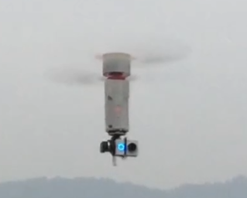

# Multicopter Airframes

A multicopter is an Aerial Vehicle that achieves flight using multiple
motors that drive propellers to provide thrust. It can be controlled and
stabilized in flight by adjusting the speeds of the motors.

As discussed in the Vehicle Evaluation section, multicopters are
suitable for aerial photography, surveying, and many other roles that
require hovering, precise maneuvering, or heavy lifting. Additionally,
multicopters are mechanically simple and easy to construct, which leads
to many airframe configurations that are further optimized for a role.

## Single/Coaxcopter

Singlecopters and coaxcopters have less than three motors that provide
thrust. Currently, they are mostly experimental designs that usually
excel in terms of flight dynamics or efficiency.

*Single/Coaxcopters are efficient because their airframe accomodates a
single large propeller; Propeller efficiency increases with prop
diameter*

  - Single/Coaxcopters may rely on rotor pitch control or control
    serfaces to achieve control and stability.
  - Their flight dynamics are somewhat complex but can still be realized
    on many autopilot systems
  - They are actively developed by many research institutes that seek to
    exploit their efficiency advantage

## Tricopter

The Tricopter has 3 motors typically arranged in a Y pattern. The rear
motor is attached to a servo, which can tilt to provide yaw control to
the Tricopter.

  - Tricopters are the simplest type of multicopter that still enjoy
    uncomplicated flight dynamics
  - They were popular earlier when motors were less reliable
  - Their stability and performance is often limited by control
    resolution, positional accuracy, and update rate of the
    servomechanism

## Quadcopter

The quadcopter has 4 motors, which can be arranged symmetrically in
various geometric layouts.

  - Quadcopters enjoy both mechanical simplicity and simple flight
    dynamics
  - Their primary drawback is a lack of redundancy, as failure of even
    one single motor will cause total loss of control.

### Quadcopter X

4 motors arranged in a X pattern and 4 frame arms linked to center of
the vehicle. This makes for a largely symmetric vehicle that further
simplifies control for pilots or flight controllers. This is the most
common layout.

### Quadcopter Wide

4 motors arranged in a X pattern but front motors are spaced further
apart. The greater separation between motors give a wide field of view
to a forward looking camera.

This configuration also shift the center of thrust to the rear of the
vehicle, which allows heavy batteries to be carried at the back of the
vehicle.

### Quadcopter H

4 motors arranged in a X pattern but frame arms are built from
horizontal booms fixed in the front and the back of the vehicle. This is
an very robust configuration, and is especially easy to cons