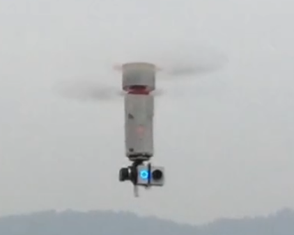

Multicopter Airframes
=====================

A multicopter is an Aerial Vehicle that achieves flight using multiple
motors that drive propellers to provide thrust. It can be controlled and
stabilized in flight by adjusting the speeds of the motors.

As discussed in the Vehicle Evaluation section, multicopters are suitable for aerial photography, surveying, and many other roles that
require hovering, precise maneuvering, or heavy lifting. Additionally, multicopters are mechanically simple and easy to construct, which leads
to many airframe configurations that are further optimized for a role.

Single/Coaxcopter
-----------------

Singlecopters and coaxcopters have less than three motors that provide
thrust. Currently, they are mostly experimental designs that usually
excel in terms of flight dynamics or efficiency.

.. note::
   Single/Coaxcopters are efficient because their airframe accomodates a single large propeller, with noting that ropeller efficiency increases with prop diameter

   image

-  Single/Coaxcopters may rely on rotor pitch control or control serfaces to achieve control and stability.
-  Their flight dynamics are somewhat complex but can still be realized on many autopilot systems
-  They are actively developed by many research institutes that seek to exploit their efficiency advantage

Tricopter
---------

The Tricopter has 3 motors typically arranged in a Y pattern. The rear
motor is attached to a servo, which can tilt to provide yaw control to
the Tricopter.

-  Tricopters are the simplest type of multicopter that still enjoy uncomplicated flight dynamics
-  They were popular earlier when motors were less reliable
-  Their stability and performance is often limited by control resolution and positional accuracy of the servomechanism

Quadcopter
----------

The quadcopter has 4 motors, which can be arranged symmetrically in various geometric layouts.

-  Quadcopters enjoy both mechanical simplicity and simple flight dynamics
-  Their primary drawback is a lack of redundancy, as failure of even one single motor will cause total loss of control.

.. note::
   Quadcopters can be easily scaled up / down, but very large quadcopters are less feasible due to unusual vibration dynamics and difficulty of controlling slow motors driving large propellers

Quadcopter X
~~~~~~~~~~~~

4 motors arranged in a X pattern and 4 frame arms linked to center of the vehicle. This is the most common layout. 

This layout makes for a largely symmetric vehicle that simplifies control for pilots or flight controllers because Pitch and Roll are linked. 

Quadcopter Wide
~~~~~~~~~~~~~~~

4 motors arranged in a X pattern but front motors are spaced further apart. The greater separation between motors give a wide field of view to a forward looking camera.

This configuration also shift the center of thrust to the rear of the vehicle, which allows heavy batteries to be carried at the back of the vehicle.

Quadcopter H
~~~~~~~~~~~~

4 motors arranged in a H pattern rotated by 90 degrees. Frame arms are built from horizontal booms fixed in the front and the back of the vehicle. This is an very robust configuration, and is especially easy to construct using basic materials and techniques. 

The downside is the vehicle body must be elongated, which leads to weight problems and sometimes torsional weakness in the body.

Quadcopter Plus
~~~~~~~~~~~~~~~

4 motor arranged in a Plus pattern and 4 frame arms are aligned with the lateral and transverse (pitch and roll) axes of the vehicle. This is a largely obsolete layout because the front motor obstructs the field of view of a forward looking camera.

This layout is also symmetric and with even simpler dynamics, and hence is popular among Makers building Quadcopters using Arduinos.

Hexacopter and Octocopter
-------------------------

The hexacopter has six motors, while the octocopter has eight. In most cases, these motors are arranged symmetrically

- Both hexacopters and octocopters are stable heavy-lifting airframes, widely used for aerial photography and agricultural applications
- Motor redundancy allows vehicle to remain airborne after one motor is disabled
- Their primary drawback is inefficiency, hence hexacopters and octocopters are not suitable for long-range or high-speed applications

Y6 and X8
---------
Y6 and X8 are variations on the hexacopter and octocopter respectively, mounting two motors co-axially on each frame arm in a contra-rotating configuration. (e.g. upper motor CCW, lower motor CW)

- Y6 and X8 are very stable and geometrically compact configurations
- Halving the number of frame arms compared to standard hexacopter / octocopters makes for mechanical simplicity
- Their primary drawback is inefficiency because the contra-rotating propellers suffers from an appxorimately 10% penalty in propulsive efficiency