# Airframes and Vehicles

Unmanned Air Vehicles (UAVs) is a broad term that encompass a wide variety of aircraft. In practice, UAVs are commonly grouped in three classes

* Multicopters: Versatile, manoeuvrable, and capable of precise hovering, but limited in endurance or range

* Fixed-Wings: Traditional planes are very efficient, and can easily achieve high speed or long distance flight

* VTOLs: Vertical-Takeoff-Or-Landing aircraft combines the benefits of fixed-wing planes and multicopters

*QGroundControl airframe selection screen*

Understanding different types of UAVs helps you choose/design an aircraft for the intended application. Once you have prepared your aircraft, the PX4 firmware must be matched to it in order to control it

## Multicopters
Multicopters use multiple motors driving propellers to achieve lift. They manoeuvre in the air by adjusting motor speeds, i.e. motor differentials. 

### Tricopter
The Tricopter has 3 motors and a servo to tilt the axial motor to counteract a net motor torque imbalance.

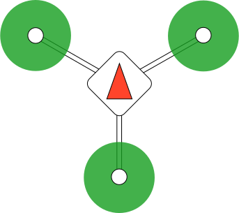

* Tricopters were popular earlier, when motors were unreliable
* Performance is limited, and may not scale well to larger sizes
* Due to their use of a servo, they are difficult to setup and maintain.

### Quadcopter
The quadcopter uses 4 motors

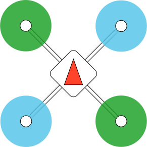

* Symmetric geometry makes for simple flight dynamics.
* Suitable for a wide range of applications, as they can be scaled up to larger sizes, and can carry diverse payloads
* Primary drawback is a lack of redundancy: Failure of even one single motor will cause total loss of control. 

#### Quadcopter configurations and designations
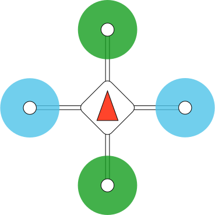	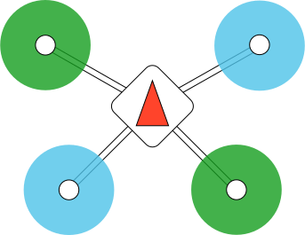	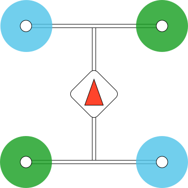

* Quadcopter X: Frame arms linked at the center of the airframe in X-shape. Most common configuration

* Quadcopter +: Frame arms are aligned to the body axes, such that four arms form a plus shape. Unpopular because the front motor blocks forward looking cameras. 

* Quadcopter Wide: Based on Quadcopter X, with front arms spread apart to give a wide field of view to a forward looking camera.

* Quadcopter H: Based on Quadcopter X, with frame arms built from single horizontal booms. Robust configuration that is especially easy to construct with basic craftsmanship.

### Hexacopter and Octocopter
The hexacopter uses six motors, while the octocopter uses eight.

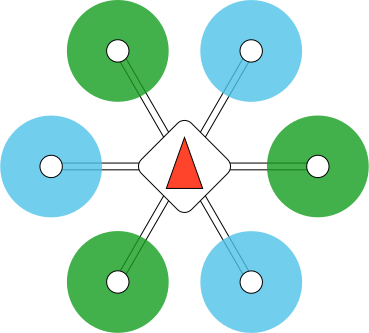	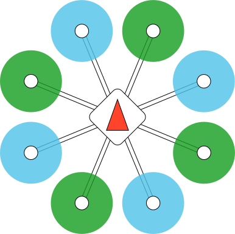

* Stable heavy-lifter configuration, widely used for aerial photography and agricultural applications
* Motor redundancy allows vehicle to remain airborne after one motor is disabled
* Primary drawback is inefficiency: Not suitable for long-range or high-speed applications

### Hexa/Octocopter Coaxial (Y6 and X8)

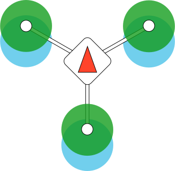	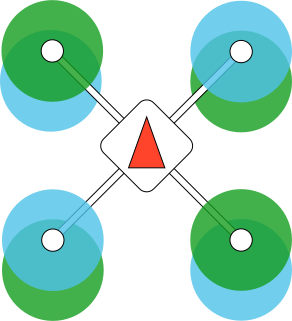

Variations on the hexacopter and octocopter respectively, mounting two motors co-axially on each frame arm in a contra-rotating configuration. (e.g. upper motor CCW, lower motor CW)

* Very stable and geometrically compact configuration that makes for mechanical simplicity and high payload capacity
* Primary drawback is inefficiency: Approx. 10% penalty in propulsive efficiency compared to a hexacopter or octocopter.

## VTOLs
VTOL aircraft usually combine a multicopter configuration with wings to achieve Vertical-Takeoff-Or-Landing while retaining the efficiency of fixed-wings. 

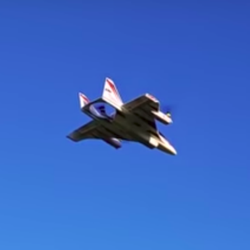

### Tailsitter
The tailsitter mounts two tractor motors on a flying wing. In fixed-wing mode, they fly like a simple twin-engine plane. In multicopter mode, the flying wing is oriented vertically, such that the motors thrust up for lift, and the wing ailerons redirect slipstream air for lateral control. 

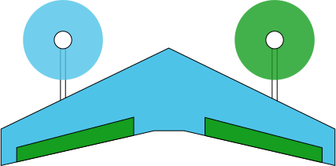

* Mechanically simplest way to achieve Vertical-Takeoff-Or-Landing.
* Primary drawback is unwieldiness: They take off nose vertically up but flies level, making payload mounting very complicated

### Tiltrotor
The tiltrotor mounts two motors that can tilt up, plus one tail motor to provide stabilization during the motor-tilting process. Short wings provide lift during forward-flight.

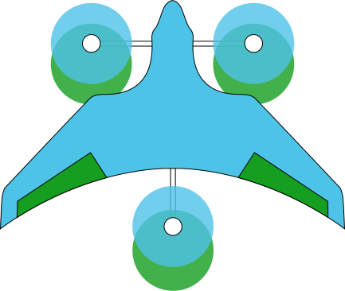

* Efficient and versatile VTOL configuration that combines many valuable features of multicopters and planes
* Primary drawback is unreliability: The tiltrotor mechanism is complex, and the VTOL transition, during which the motor tilts, is hard to control

### Quadplane
The quadplane mounts four motors in a Quadcopter X configurations to a fixed wing plane, which also has a motor for propulsion

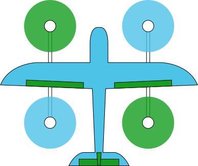

* Most reliable VTOL configuration that uses no moving actuators or changing vehicle orientation in flight.
* Primary drawback is inefficiency: quadcopter motors are useless in fixed-wing mode, and plane motor is useless in multicopter mode